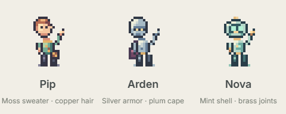
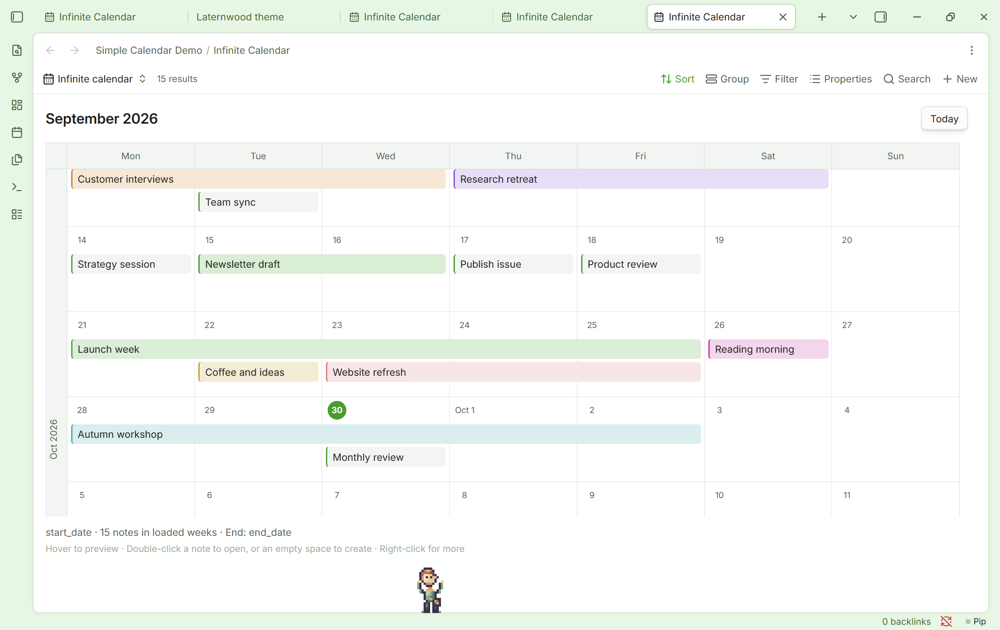
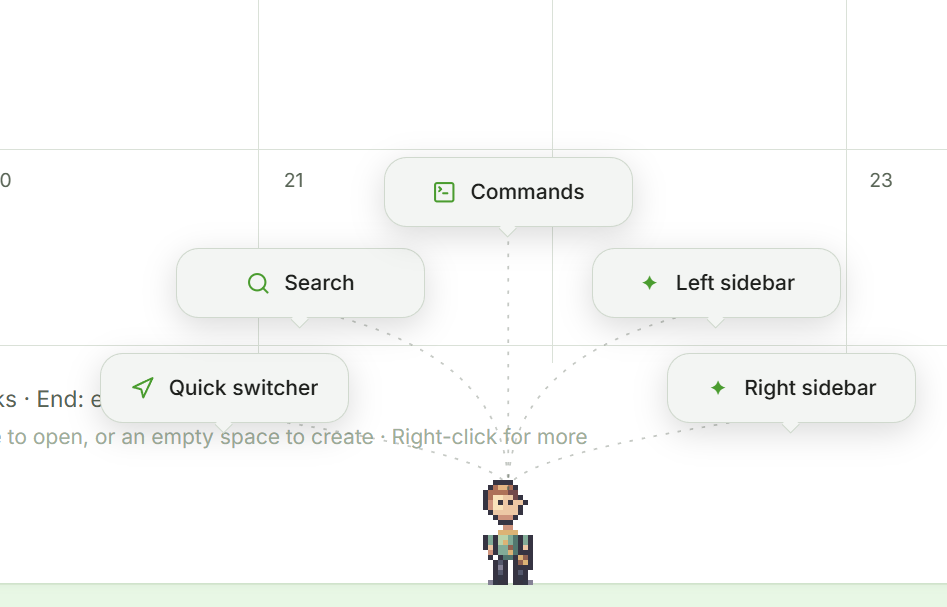
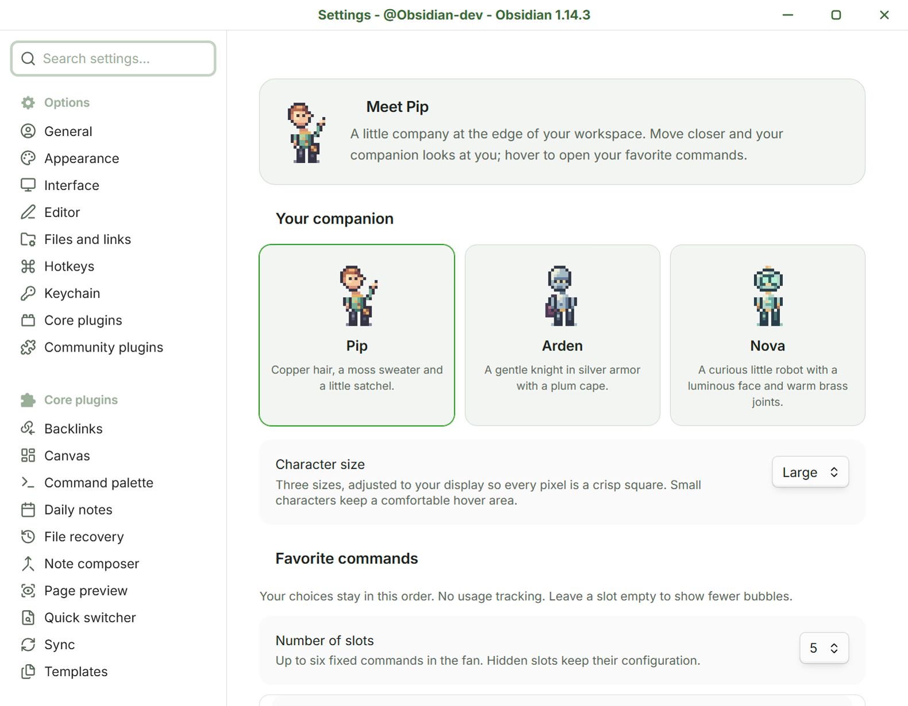

# Little NPC

> Not everything has to be about productivity and keyboard shortcuts. Sometimes your workspace just needs a tiny friend who wanders around, waves hello, and gives you an excuse to slow down for a second. The handy commands are a bonus.

**A little company at the edge of your Obsidian workspace.** Pip, Arden and Nova are original pixel-art companions with a life of their own. Your chosen character strolls along the status bar, takes little breaks, watches your mouse, and opens a fan of your favorite commands when you hover or click.

[](https://github.com/DavidHurtadoAI/little-npc/releases/latest)
[](https://github.com/DavidHurtadoAI/little-npc/actions/workflows/ci.yml)
[](LICENSE)



## A small companion, a gentle pace

Your NPC chooses its own little activities. It might wander, sit down, stretch, wave or doze. Bring the mouse closer and it pauses what it is doing to look at you. Its head follows the pointer in four directions: left, right, up-left and up-right.



*Pip taking a stretch while you work. This example uses the Lanternwood theme and an Infinite Calendar view; neither is required by Little NPC.*

## Your commands, a hover away

Hover over the character to open a fan of speech bubbles. Click a bubble to run that command in your current Obsidian context. You can also click the character to open the fan immediately.



- Choose **up to six fixed commands** from Obsidian or enabled plugins. Five slots are shown by default.
- Keep them in your preferred order. Little NPC does not rank commands or track how often you use them.
- Add an optional short label. Long labels are shortened, and the tooltip keeps the full command name.
- Leave a slot empty to show fewer bubbles. Hidden slots retain their choices when you reduce the slot count.
- Move across the gaps toward a bubble: the fan stays open. Move away and it closes after a short grace period.
- Editor focus and selection are restored before the selected command runs.

The default five commands are **Quick switcher**, **Search**, **Command palette**, **Toggle left sidebar** and **Toggle right sidebar**. The sixth default slot opens **Settings** when you enable it. A command from a disabled or removed plugin appears unavailable until you choose a replacement.

## Meet the companions

| Character | Personality in pixels |
| --- | --- |
| **Pip** | Copper hair, a moss sweater and a little satchel. |
| **Arden** | A gentle medieval knight in silver armor with a plum cape. |
| **Nova** | A curious mint robot with a luminous face and warm brass joints. |

The names and designs are gender-neutral. **One character is active at a time**; switch between them in settings.

The artwork is drawn cell by cell on a **16 × 24 pixel grid**, with colored highlights and shadows. Small, Medium and Large adjust to your display scale so every art pixel remains a uniform square, including at fractional display scales and when Obsidian's zoom changes. The character's position follows the same screen grid. Smaller sizes retain a comfortable hover target.

## Install

This version is distributed through GitHub releases. It has not been submitted to Obsidian's Community Plugins directory.

1. Download **`little-npc-0.3.1.zip`** from the [latest release](https://github.com/DavidHurtadoAI/little-npc/releases/latest).
2. Create a folder named `little-npc` inside your vault's `.obsidian/plugins/` folder.
3. Extract the ZIP into that folder. The three plugin files must sit directly inside it:

   ```text
   <your-vault>/
     .obsidian/
       plugins/
         little-npc/
           main.js
           manifest.json
           styles.css
   ```

4. In Obsidian, open **Settings → Community plugins**, enable community plugins if needed, and refresh the installed plugin list or restart Obsidian. Enable **Little NPC**.
5. Open **Settings → Little NPC** to choose your companion and commands.

You can also download `main.js`, `manifest.json` and `styles.css` individually from the release and place them in the same folder. Obsidian's [community plugin help](https://help.obsidian.md/Extending+Obsidian/Community+plugins) explains the plugin controls.

To update a manual installation, disable Little NPC, replace those three files with the new release, and enable it again. Keep `data.json`: it contains your saved choices.

## Make it yours



| Setting | What it does | Default |
| --- | --- | --- |
| **Your companion** | Choose Pip, Arden or Nova. | Pip |
| **Character size** | Small, Medium or Large, with crisp display scaling. | Large |
| **Number of slots** | Show one to six command slots. | 5 |
| **Command / Short label** | Pick each command and optionally give its bubble a shorter name. | Five ready-to-use commands |
| **Walking speed** | Set the pace from 8 to 48 pixels per second. | 24 |
| **Attention distance** | Set how close the mouse gets before the NPC stops to look at it, from 80 to 240 pixels. | 150 |
| **Hover delay** | Wait from 0 to 800 milliseconds before opening the fan. Clicking opens it immediately. | 180 ms |
| **Bring your companion back** | Call the NPC to a nearby spot. | Also available from the status bar |

Click the companion's name in the status bar to call it over. Right-click the character or the status-bar name to open settings.

## What can the NPC do?

The settings include a **read-only gallery with animated previews of all ten behaviors** for the selected character. Individual actions are not configurable in this version.

| Action | Behavior |
| --- | --- |
| **Wander** | Walk in either direction, pausing and changing destination. |
| **Rest** | Stand still and blink. |
| **Look around** | Turn the head and glance around. |
| **Sit down** | Take a short break on the edge of the status bar. |
| **Stretch** | Lift both arms, hold the stretch, then relax. |
| **Wave** | Raise an arm, wave an open hand from side to side, then lower it. |
| **Investigate** | Lean down to inspect something near the feet. |
| **Doze** | Sit, close the eyes and drift off for a moment. |
| **Follow the mouse** | Pause and turn the head toward the pointer. |
| **Offer commands** | Open the fan and stay still while you choose. |

The first eight are autonomous activities. The last two respond to your pointer or interaction. The NPC pauses while Obsidian is in the background and respects the system's **Reduce motion** preference.

## Keyboard access

Mouse interaction is the main idea, and keyboard access is available too:

- Focus the character and press **Enter**, or run **Little NPC: Open favorite commands** from Obsidian's command palette.
- Use the **arrow keys**, **Home** or **End** to move between bubbles.
- Press **Escape** to close the fan and restore the previous focus.
- **Little NPC: Call your companion here** brings it back; **Little NPC: Configure favorite commands** opens settings.

## Privacy and compatibility

Little NPC has **no runtime dependencies, network requests, analytics or command usage history**. Settings stay in this vault. It does not read your note contents. Selected commands run through Obsidian's command dispatcher and retain their normal behavior.

This is a **desktop plugin for the main Obsidian window**. Extra pop-out workspace windows and mobile are not supported. The current release has been tested in Obsidian **1.14.3**; the manifest declares a minimum version of **1.5.0**, but older versions have not all been tested.

The command catalog and dispatcher are internal Obsidian APIs. Access is feature-detected and kept in a small adapter; Little NPC does not wrap or intercept command callbacks. Compatibility with future Obsidian changes may require updates.

## Development

Use **Node.js 24 LTS** and npm. The source is TypeScript, with no runtime libraries.

```sh
npm ci
npm run check
```

`check` runs strict TypeScript checking, the unit tests and a production build. `npm run build` creates `main.js`. The tests cover settings recovery, preserved choices, screen pixel scaling, sprite bounds, the four head directions, greeting phases, label abbreviation, fan placement and autonomous movement bounds. GitHub Actions runs the same checks on pushes and pull requests.

The main pieces are:

- `src/sprite.ts`: original pixel matrices, palettes and animation poses.
- `src/pixel-grid.ts`: integer enlargement and physical-pixel alignment.
- `src/companion.ts`: wandering, pointer attention and the command fan.
- `src/core.ts`: settings, behavior choices and fan geometry.
- `src/main.ts`: Obsidian lifecycle, settings and command dispatch.
- `styles.css`: the companion, bubbles and settings UI.

## Artwork and license

All three characters and their animations are original artwork. The design takes cues from atmospheric pixel art; no game assets are used. Useful references include [Derek Yu's pixel-art tutorial](https://www.derekyu.com/makegames/pixelart.html), [Saint11 on clusters](https://saint11.art/pixel_art_articles/article2/), [Saint11 on animation](https://saint11.art/pixel_art_articles/article3/) and [MDN's canvas rendering guidance](https://developer.mozilla.org/en-US/docs/Web/API/Canvas_API/Tutorial/Optimizing_canvas).

Code and original artwork are released under the [MIT License](LICENSE). Created by **David Hurtado**.
