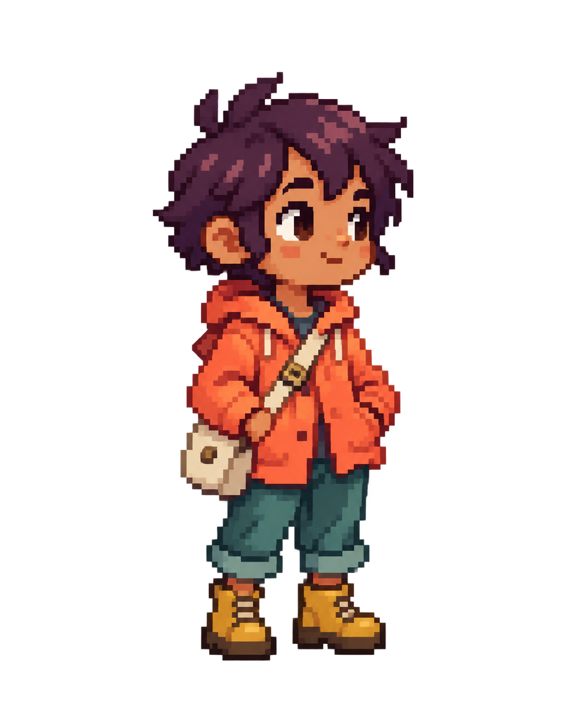

# Create your own companion

This kit defines the **Just Simple NPC v1 sprite-sheet format**. Generate a sheet with an image model, or draw it by hand. Creation happens outside Obsidian; importing and animating the result stays local to your vault.

## Download the kit

- [Complete creation kit](creation-kit.zip): templates, blank sheets, the reference character, layout map and prompt.
- [Pip template](pip-template.png), [Arden template](arden-template.png), [Nova template](nova-template.png): **1024 × 1536**, genuine PNG transparency and exact integer enlargement. Use one as the pose/layout reference for an image model.
- Native sheets: [Pip](pip-native.png), [Arden](arden-native.png), [Nova](nova-native.png). These **128 × 192** sheets can be imported directly to test the feature.
- [Blank native sheet](blank-native.png): an empty, fully transparent **128 × 192** canvas for drawing by hand. Fill its required cells before importing.
- [Blank grid guide](blank-grid-guide.png): **1024 × 1536** with guide lines on magenta. This is a drawing/layout aid; remove the lines and fill the cells before importing it.
- [Labeled layout guide](layout-guide.png) and [machine-readable format](layout-v1.json).
- [Example character reference: Rue](rue-reference.png). Rue is an original, gender-neutral traveler with plum hair and a coral rain jacket. This is a design reference, not an importable animation sheet.
- [Copy the generation prompt](prompt.txt).

## Generate a character

1. Download a filled template, such as `pip-template.png`, and [prompt.txt](prompt.txt).
2. In ChatGPT or another image-generation tool, attach **your character image first** and **the filled template second**. Rue is available as a sample character. You can optionally attach the labeled layout guide third.
3. Paste the prompt. It assigns a different role to each image, specifies every cell and explains true transparency and the magenta fallback.
4. Download the PNG. Inspect the whole sheet and its animations; an image that looks attractive can still have misplaced or inconsistent frames.
5. Save it inside your Obsidian vault, for example `NPCs/Rue.png`. In **Settings → Just Simple NPC → Custom companion**, choose the sheet. Give it a name, review the preview, then select **Use this companion**. The behavior gallery now previews all thirteen custom actions.

The prompt is model-independent. It follows the official guidance to assign reference roles, state the details that must remain fixed and inspect the returned alpha channel. [OpenAI image prompting guidance](https://developers.openai.com/api/docs/guides/image-prompting).

## The format

The sheet contains **8 columns × 8 rows**, with a **16 × 24 logical-pixel frame**. Native size is **128 × 192**. Whole-number enlargements are accepted, including **1024 × 1536**; both axes must use the same factor, up to **2048 × 3072**. Enlarged images are sampled down to the native grid without smoothing, so preview the result before activation.

There are **60 required frames**. Coordinates use columns A–H and rows 1–8. Four frames are reserved and ignored.

| Cells | Animation |
| --- | --- |
| A1–H1 | Walking loop; faces right and is mirrored by the plugin when walking left. |
| A2–D2 | Idle and blink. |
| E2–H2 | Look around: left, right, up-left, up-right. |
| A3–B3 | Seated rest. |
| C3–H3 | Stretch, raise both arms, hold and lower. |
| A4–H4 | Wave: preparation, lift, hand movement, lower and recover. |
| A5–D5 | Investigate near the feet. |
| E5–H5 | Doze while seated. |
| A6–D6 | Follow the mouse: left, right, up-left, up-right. |
| E6–H6 | Offer commands: the same four directions. The plugin draws the bubbles. |
| A7–D7 | Picked up: raised, fidgeting hands and bent feet. |
| E7–H7 | Falling reaction. The plugin supplies position and gravity. |
| A8–D8 | Soft landing and settled seated rest. The last frame is held. |
| E8–H8 | Reserved. Keep empty. |

Keep the same silhouette, palette, head size and cell origin throughout. Grounded feet end just before logical y=23. Keep the character inside each frame, with transparent corners. The engine supplies movement, falling physics, the pause after landing and command interaction; the sheet supplies the visual poses.

## Transparency and common repairs

- **PNG transparency:** retain the real alpha channel. A checkerboard painted into the PNG is an opaque background.
- **Auto-remove solid background:** preserve existing alpha and remove a consistent flat background connected to frame edges. Enclosed matching details, such as white inside a dark outline, remain intact.
- **Remove magenta:** use this for a flat `#FF00FF` background. Keep that color out of the character.

The loader checks the PNG signature and dimensions, caps file size at 12 MB, samples onto the native grid, and turns alpha into opaque/transparent pixels for crisp art. Empty required frames and opaque frame corners are rejected with a cell coordinate. It cannot repair a wrong animation order or judge whether a walk looks natural: use the animated gallery for that.

If a result has a painted checkerboard, ask for **real alpha** or a **uniform magenta background**, rather than trying to erase a textured background. If the dimensions are wrong, request **1024 × 1536 with 8 × 8 cells and no spacing**. If the character jumps in size, ask to correct only those cells while preserving the grid and identity.

Selected PNGs are watched for changes and renames. Missing or invalid files fall back to Pip while keeping the saved selection. Forgetting a sheet does not delete the PNG from your vault.

## Regenerate the templates

Run `npm run export:sheets`. The templates come from the plugin's original code-authored sprites and are exported with real alpha. The Rue reference was generated with the built-in image-generation tool; its exact generation prompt is saved in [reference-prompt.txt](reference-prompt.txt).

Code and these assets use the repository's MIT license.
